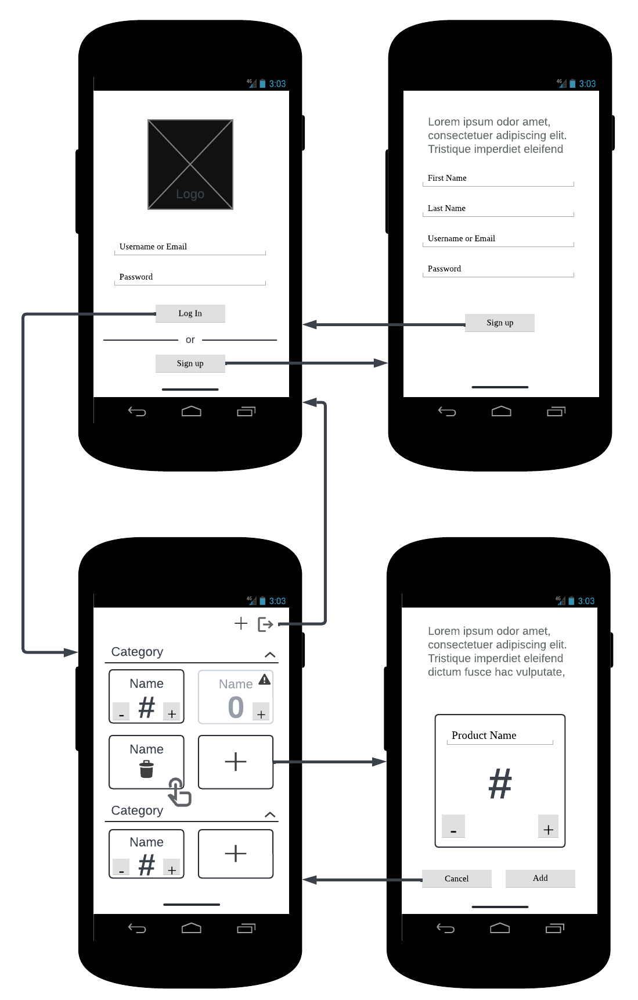
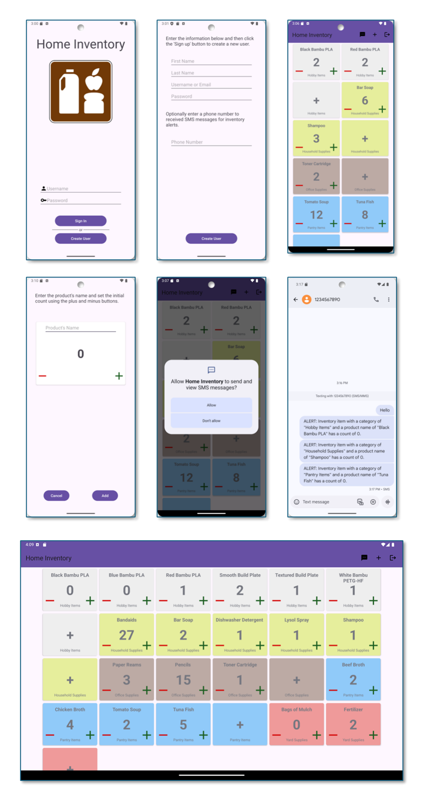

# CS-360-15309-M01 Mobile Architect & Programming 2024 C-5 (Sep - Oct)

```
 _____  _   _  _   _  _   _   _____  _____          _____   ____  _____ 
/  ___|| \ | || | | || | | | /  __ \/  ___|        |____ | / ___||  _  |
\ `--. |  \| || |_| || | | | | /  \/\ `--.  ______     / // /___ | |/' |
 `--. \| . ` ||  _  || | | | | |     `--. \|______|    \ \| ___ \|  /| |
/\__/ /| |\  || | | || |_| | | \__/\/\__/ /        .___/ /| \_/ |\ |_/ /
\____/ \_| \_/\_| |_/ \___/   \____/\____/         \____/ \_____/ \___/ 
                                                                        
```

## Course Information
|              |                                                                                                                                                                        |
| ------------ | ---------------------------------------------------------------------------------------------------------------------------------------------------------------------- |
| Institution  | Southern New Hampshire University                                                                                                                                      |
| Course       | [CS-360-15309-M01 Mobile Architect & Programming 2024](https://learn.snhu.edu/d2l/home/1698605 "CS-360-15309-M01 Mobile Architect & Programming 2024 C-5 (Sep - Oct)") |
| Instructor   | **Bill Chan, M.S.** b.chan@snhu.edu                                                                                                                                    |
| GitHub       | btcsnhu                                                                                                                                                                |
| Linked In    |                                                                                                                                                                        |
| Course Dates | 09/02/2024 - 10/27/2024                                                                                                                                                |
| Status       | Active/Online                                                                                                                                                          |

## Artifacts
| Description                           | Link                                                                                                                                                                 |
| :------------------------------------ | :------------------------------------------------------------------------------------------------------------------------------------------------------------------- |
| Project Three Mobile Application Zip  | [Allan_ODriscoll_CS360_7_2_Project_Three_Inventory_Application_Code_20241020.zip](Allan_ODriscoll_CS360_7_2_Project_Three_Inventory_Application_Code_20241020.zip)   |
| Project Three Mobile Application      | [Allan_ODriscoll_CS360_7_2_Project_Three_Inventory_Application_Code_20241020](Allan_ODriscoll_CS360_7_2_Project_Three_Inventory_Application_Code_20241020)           |
| Project Three Launch Plan             | [Allan_ODriscoll_CS360_7_2_Project_Three_Inventory_Application_20241020.docx](Allan_ODriscoll_CS360_7_2_Project_Three_Inventory_Application_20241020.docx)           |

## 8-3 Journal: Portfolio Submission

### Briefly summarize the requirements and goals of the app you developed. What user needs was this app designed to address?

In project three, I chose to work on an inventory management application for Android. The project had several requirements, including the following:

- A database that could store information about users and inventory items.
- A login screen and a way to create new users.
- A screen that displays the inventory items in a grid.
- A mechanism to add and remove items from the inventory.
- A mechanism to adjust the inventory count.
- A mechanism to alert users when the inventory level drops to zero.

I decided to target home users who would use the application to maintain the inventory levels in their pantry and for other household items. The user base would include those who cooked meals, shopped for groceries, engaged in hobbies, and who consumed items from the inventory. I wanted the app to be straightforward and easy to use. One way that I accomplished this is by limiting the need for keyboard input. Once the application has been configured, the inventory is managed by scrolling through the list of items and clicking on buttons.

In addition to the requirements listed above, I also added the following:

- Support for multiple users. Each user has their own inventory items.
- Support for inventory categories. Categories can either be private or shared.

### What screens and features were necessary to support user needs and produce a user-centered UI for the app? How did your UI designs keep users in mind? Why were your designs successful?

The original design included four screens that would support the user's needs.

- A login screen where users could enter their credentials and log in to the application. A button was also provided on the login screen to support the creation of new users.
- A screen where users could fill out a form to create new user accounts.
- An inventory screen allowing users to manage items in the inventory.
    - Items can added by clicking on a category placeholder card. This takes the user to the "Add Inventory Item" screen
    - Items can be removed by long-clicking on an item or category.
    - The inventory count can be adjusted by clicking on the plus or minus buttons on each card.
- A screen to add new inventory items.
- A database where all user and inventory information would be stored.

This UI design looked like the following:



The final deliverable was close to this design, and I believe that it successfully met the project goals. The UI design kept the users in mind by keeping things simple and ensuring that the navigation between screens was intuitive. As mentioned, I also avoided the need for keyboard input where possible. Here are a few screenshots of the completed application.



### How did you approach the process of coding your app? What techniques or strategies did you use? How could those techniques or strategies be applied in the future?

One strategy was to build the code in phases. The first phase, done in Project Two, was all about building the UI. I wrote enough code to get navigation working between screens and also to mock up the data on the inventory screen. The second phase, done in Project Three, is where most of the business logic and program functionality was built. As I worked on the logic for each screen, I built the related model objects, database interfaces, and controllers. This allowed me to develop and test each screen independently. The last phase, also done in Project Three, included end-to-end testing and fine-tuning the overall functionality. I believe that this strategy would work for most future projects. It simplifies the work when you break things down into phases like this.

### How did you test to ensure your code was functional? Why is this process important, and what did it reveal?

I tested the code in several different ways. First, as a developer, I walked through the code with the debugger, followed the program logic, and examined variables to ensure that the code functioned correctly. I also made use of log messages to trace what was happening as I executed different test cases. Second, as a user, I tested the navigation flows, the input field, and the buttons to ensure they produced the correct behavior. I also asked several family members to do the same so that I could get their perspective. This process revealed a number of programming errors. For example, in one case, I forgot to include a variable in the activities response. As a result, the data wasn't updated in the database. By testing in this manner, I was able to find and correct the bug.

### Consider the full app design and development process from initial planning to finalization. Where did you have to innovate to overcome a challenge?

One challenge that I had was related to handling events for the cards in my inventory recycler view. The code has several nested classes, and I wasn't sure where event callbacks needed to be placed. I searched the documentation but wasn't able to find the answers that I was looking for. I ended up solving the problem through a series of experiments using debug logging to see where the events were being invoked.

### In what specific component of your mobile app were you particularly successful in demonstrating your knowledge, skills, and experience?

The most complicated screen that I built was the main inventory screen. This included a recycler view and a dynamic number of cards. The data needed to be backed by something that was equally dynamic. I used a list view model object along with the LiveData APIs to accomplish this. There were a lot of new concepts that I had to understand to build this screen. The Room database was also very helpful. In the end, I was very pleased with the result.